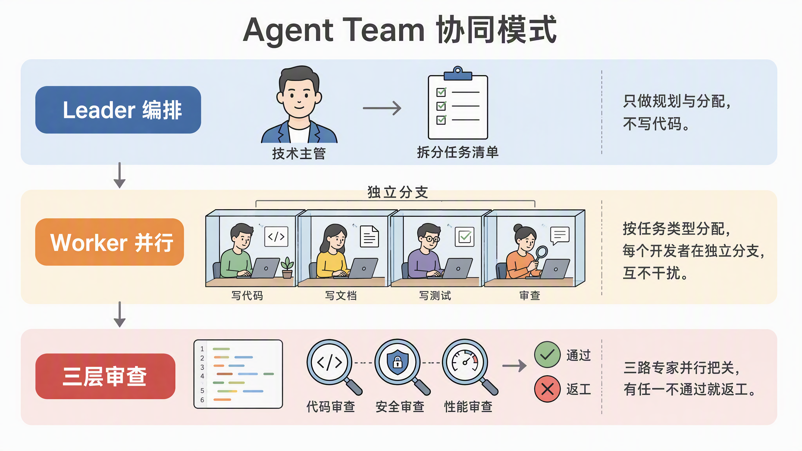

# Code-Harness-Kit

<p align="left">
  <a href="./LICENSE"></a>
  <a href="./.agents/agents/"></a>
  <a href="./.agents/skills/"></a>
  <a href="./platform/"></a>
  <a href="#"></a>
</p>


**生产级 AI Agent 协同框架**：把项目规则、路由判定、阶段门禁、过程产物、集体测试与集体审查、双层适配与工具链打包成一套脚手架，让 LLM 像一支有纪律的工程团队一样交付软件。

> **核心价值**：解决 LLM 代码生成"可靠性、一致性、长期可维护性"三大顽疾。Harness 像马具——用缰绳与鞍具把马力引到正确方向，而不是限制能力本身。
>
> **核心理念**：**Agent Team · 阶段门禁 · 集体测试 · 集体审查 · 文档驱动**——五件套协同，避免"单 Agent 一把梭哈"的失控。

---




## 目录

- [这是给谁的](#这是给谁的)
- [它解决什么问题](#它解决什么问题)
- [五大设计理念](#五大设计理念)
- [架构设计](#架构设计)
  - [双层结构：深读层 vs 投影层](#双层结构深读层-vs-投影层)
  - [平台适配机制](#平台适配机制)
  - [目录结构](#目录结构)
- [Agent Team：多 Agent 协同工作](#agent-team多-agent-协同工作)
  - [角色体系](#角色体系)
  - [Leader 职责](#leader-职责)
  - [Worker 分工](#worker-分工)
  - [协作模式](#协作模式)
- [软件工程方法论](#软件工程方法论)
  - [阶段门禁链](#阶段门禁链)
  - [Tier 分级体系](#tier-分级体系)
  - [文档驱动开发](#文档驱动开发)
  - [References 强制检查](#references-强制检查)
- [集体测试与集体审查](#集体测试与集体审查)
- [快速接入](#快速接入)
- [核心文件索引](#核心文件索引)

---

# 这是给谁的

Harness Kit 适合以下场景：

- 你在用 **Cursor / Claude Code / Trae** 写代码，但发现 LLM 单兵作战常常"看起来对、其实跑偏"
- 你需要**多任务并行**开发，却担心 Worker 之间互相改坏文件
- 团队希望 AI 交付物有**阶段门禁**（spec 确认、plan 确认），而不是"写完就提 PR"
- 你关心**安全性、性能、可访问性**在每批次都被强制审查，而不是事后补丁
- 你希望 AI 工作过程**可追溯**——plan、tracking、verification、review 全部落盘
- 你在多个项目之间复用同一套 Agent 工作流，不想每项目都重写规则

---

# 它解决什么问题

| 痛点 | Harness 的做法 |
|------|----------------|
| LLM 写代码"看着对、跑起来崩" | **阶段门禁**：spec → plan → 派发 → 集体测试 → 集体审查，每步都有产物落地 |
| 复杂任务一把梭哈、上下文爆炸 | **Worker 拆分**：Leader 不亲自写大规模代码，按 WU 委派给对应 Worker |
| 多任务并行改同一文件、相互打架 | **Git Worktree 隔离**：每个 WU 独立 worktree，文件所有权清晰 |
| 测试只跑 happy path | **集体测试**：Leader 在 worktree 内重跑全部验证命令，禁"应该通过" |
| 审查走过场、信任 > 验证 | **三层并行审查**：Reviewer（五轴）+ Security-Auditor（OWASP）+ Perf-Auditor（CWV） |
| 重复造规则、每个项目重写入口 | **双层结构**：深读层（核心规则）+ 投影层（平台入口），升级与业务解耦 |
| AI 跑偏了没人拦 | **防幻觉机制**：未跑命令就声称完成 = 无效；产物未引用 References = 退回 |

---

# 五大设计理念

| 理念 | 一句话解释 |
|------|-----------|
| **Agent Team** | Leader + Worker 角色分工，多 Agent 协同而非单 Agent 一把梭 |
| **阶段门禁** | spec / plan 写完必须暂停等用户确认，禁止"未批先写" |
| **文档驱动** | 五级上下文层级 + 所有产物落盘到 `.ai-runtime-artifacts/`，跨会话可接续 |
| **集体测试 + 集体审查** | 批次收尾强制三重并行审查（代码 / 安全 / 性能），不靠"信任"靠"验证" |
| **双层结构 + 平台适配** | 深读层（核心规则） + 投影层（Cursor / Claude Code / Trae），跨平台一致 |

---

# 架构设计

## 双层结构：深读层 vs 投影层

Harness 采用**双层架构**，分离"AI 详细规则"与"平台入口文件"——升级脚手架不会污染业务代码。

```
┌─────────────────────────────────────────────────────────────────┐
│                     接入项目（根目录）                            │
├─────────────────────────────────────────────────────────────────┤
│  AGENTS.md          ← 平台入口（投影层：精简，指针）             │
│  CLAUDE.md          ← Claude Code 入口                          │
│  .cursor/rules/     ← Cursor 入口                               │
│  .agents/agents/    ← 共享 subagent（投影层）                  │
│  .claude/skills/    ← 共享 skill（投影层）                     │
└─────────────────────────────────────────────────────────────────┘
                              ↑
                         脚本投影
                              ↑
┌─────────────────────────────────────────────────────────────────┐
│                   harness-kit/（脚手架仓库）                      │
├─────────────────────────────────────────────────────────────────┤
│  core/orchestration/  ← 深读层：详细规则（不投影）               │
│  core/routing.md      ← 路由判定 + 阶段门禁 + references 索引    │
│  core/capabilities/   ← 抽象原语                                │
│  platform/            ← 平台适配（cursor / claude / trae）       │
│  .agents/agents/      ← 共享 subagent stub                      │
└─────────────────────────────────────────────────────────────────┘
```

**原则**：
- `core/routing.md` 是**单一真相源**，包含路由、阶段门禁、Tier 分级、references 索引
- 根目录 `AGENTS.md` 是 Harness 覆盖层，只引用 routing.md
- 平台适配器 `platform/` 提供 Cursor / Claude Code / Trae 特定绑定
- 业务代码改动与脚手架升级**完全解耦**

## 平台适配机制

```
┌──────────────────────────────────────────────┐
│  routing.md（路由判定，平台无关）             │
└─────────────────┬────────────────────────────┘
                  │ 平台特定绑定
    ┌─────────────┼─────────────┬─────────────┐
    ▼             ▼             ▼             ▼
platform/     platform/    platform/    platform/
cursor/       claude/      trae/        agents/  ← 共享层
bindings.md   bindings.md  (骨架)       (stub)
```

| 适配器 | 绑定内容 |
|--------|----------|
| `platform/cursor/` | Cursor 编排、spawn、hooks 绑定 |
| `platform/claude/` | Claude Code bindings、能力矩阵 |
| `platform/trae/` | Trae 骨架（实验性） |
| `platform/agents/` | 共享 subagent（所有平台共用） |

**平台能力矩阵（节选）**：

| Capability | Cursor | Claude Code |
|------------|--------|-------------|
| `SpawnWorker` | `Task` 工具 | `Task(subagent_type=generalPurpose)` |
| `StructuredAsk` | `AskQuestion` | `AskUserQuestion` |
| `GitWorktree` | 原生支持 | 原生支持 |
| `CollectiveReview` | 并行 Task | 并行 Task |
| `LoadSkill` | Read + Skill 工具 | Skill 工具 |

> 完整能力矩阵见 `platform/claude/capability-matrix.yaml` 与 `platform/cursor/capability-matrix.yaml`。

## 目录结构

```
harness-kit/
├── README.md                    # 本文件
│
├── core/                        # 通用规则（不随业务重写）
│   ├── harness.md               # 总契约 + 布局检测
│   ├── routing.md               # 路由判定 + 阶段门禁 + Tier 分级  ★必读
│   ├── artifacts.md             # 产物规范
│   │
│   ├── capabilities/            # 能力注册表
│   │   ├── registry.md
│   │   └── primitives.md
│   │
│   ├── orchestration/           # 编排核心
│   │   ├── dispatcher-workflow.md    # 派发 + 整合 + 尾盘
│   │   ├── agents/                   # Leader / Coder / Reviewer 等详细 prompt
│   │   ├── runtime/                  # 运行时配置
│   │   ├── tracking/                 # 追踪 schema
│   │   ├── skill-preferences.md      # 默认 skill 路由表
│   │   └── claude-continuous-loop.md # Claude Code 物理能力诚实声明
│
├── platform/                    # 平台适配
│   ├── cursor/                  # Cursor binding
│   ├── claude/                  # Claude Code binding
│   ├── trae/                    # Trae 骨架
│   └── agents/                  # 共享层（投影用）
│
├── init/                        # 接入脚本 + 话术
│   ├── bootstrap.prompt.md      # 新项目接入详版
│   ├── project-profiler.prompt.md
│   └── onboarding-handoff.txt
│
├── scripts/                     # 工具脚本
│   ├── harness-project.sh       # 投影脚本（生成 AGENTS.md 等）
│   ├── harness-check.sh         # 一致性检查
│   ├── harness-worktree.sh      # Git Worktree 管理
│   ├── install-ai-skills.sh     # 安装脚本
│   └── scan-artifacts-graph.js  # 产物图谱扫描
│
├── artifact-templates/           # 产物模板（FM + Next 契约）
│   ├── spec.harness-overlay.md
│   ├── plan.harness-overlay.md
│   ├── dispatch.harness-overlay.md
│   ├── verification.md
│   ├── verification-lite.md
│   ├── collective-test.md       # 集体测试产物模板
│   ├── code-review.md           # 集体审查产物模板
│   ├── decision.md
│   └── ...（完整列表见目录）
│
├── project.profile.md           # 项目画像（接入后生成）
├── context-map.md               # 上下文地图（接入后生成）
├── project.verification.md      # 验证命令（接入后生成）
└── project.git.md               # Git 差异（接入后生成）
```

---

# Agent Team：多 Agent 协同工作

Harness 把 AI 抽象成一支**工程团队**：Leader 做编排与门禁，Worker 按角色分工，多个审查 Agent 并行把关。

## 角色体系

```
┌─────────────────────────────────────────────────────────────────┐
│                         你（甲方）                               │
│                    确认范围 / 审批门禁                            │
└─────────────────────────────┬───────────────────────────────────┘
                              │
                              ▼
┌─────────────────────────────────────────────────────────────────┐
│                       Leader（编排者 / 技术主管）                  │
│      路由判定 · 拆 WU · 派发 · 整合 · 汇报 · 阶段门禁              │
└───────────┬───────────┬───────────┬───────────┬────────────────┘
            │           │           │           │
            ▼           ▼           ▼           ▼
        Coder    Implementer  Test-Engineer  Reviewer
     （写代码）   （文档/配置）   （E2E/测试）  （独立审查）
            │           │           │
            └───────────┴───────────┘
                        │
                        ▼
               Git Worktree（隔离）
                        │
                        ▼
        ┌───────────────────────────────────────┐
        │    尾盘：B 集体审查（并行三层扇出）     │
        │  Reviewer · Security-Auditor · Perf-Auditor│
        └───────────────────────────────────────┘
```

## Leader 职责

**Leader** 是主 Agent / 技术主管，**不亲自写大规模业务代码**（Tier 1 简单实现除外）。

| 职责 | 说明 |
|------|------|
| **路由判定** | 每个任务首句声明 `「Harness：<route>」` |
| **阶段门禁** | spec / plan 写完后**暂停**，等用户确认才进入下一步 |
| **拆 WU** | 从 plan 提取 Work Unit，写执行图（GROUP / 依赖 / 文件所有权） |
| **派发** | 按 `wu_type` 委派给对应 Worker（并行 ≤5） |
| **整合** | 验证 Worker 返回，更新 tracking，**不写批次完成态** |
| **尾盘** | 集体测试 → 三层并行集体审查 → 落盘两类产物 |
| **汇报** | 对甲方输出"状态 · 风险 · 验收口径" |

**Leader 禁止**：
- 与 Worker 共用同一 subagent 实例做审查
- 未写 tracking 就并行派发多个 WU
- 末个 WU 返回后直接"完成"（须先走尾盘 A + B）
- 在主 checkout 写业务代码（小改动除外）
- 自动 push / 开 PR

## Worker 分工

| 角色 | `wu_type` | 职责 | 禁止 |
|------|-----------|------|------|
| **Coder** | `feature` `bugfix` `refactor` `ui` `review-fix` | 实现 + 单测 + 自测 + 轻量审查 + self_check | E2E/集成测试、改 plan |
| **Implementer** | `docs` `chore` `config` | 文档 / 配置 / 轻量变更 | 代码闭环、改 plan |
| **Test Engineer** | `test` `e2e` | 集成 / E2E / 前端自动化 | 改业务实现 |
| **Reviewer** | `review` | 五轴独立 code review（只读） | 与写代码同一实例 |
| **Security-Auditor** | `security-review` | OWASP + LLM 安全审查（只读） | 写文件 |
| **Perf-Auditor** | `perf-review` | CWV + N+1 + Bundle 性能审查（只读） | 写文件 |
| **Code-Simplifier** | `simplify` | Chesterton's Fence → 逐个变更 | 功能改动 |
| **Explorer / Debugger** | — | 摸底、查 bug | — |
| **Web Investigator** | — | 信息调研 / 网页搜索 | — |

### Coder 交付清单

| 项 | 要求 |
|----|------|
| **实现** | 只改 Leader 允许的文件（通常 ≤5 个） |
| **单测** | 有新增逻辑就要测；豁免须说明 |
| **自测** | 跑 Leader 指定的**单测 / lint** 命令 |
| **轻量审查** | `requesting-code-review` + 独立 reviewer |
| **开发者自检** | `self_check: PASS` 才能报完成 |

## 协作模式

### 阶段链（端到端）

```
brainstorming → [门禁：用户确认 spec]
→ writing-plans → [门禁：用户确认 plan]
→ 派发 WU（并行 ≤5，Git Worktree 隔离）
→ 尾盘 A：集体测试（Leader 落盘 collective-test）
→ 尾盘 B：三层并行集体审查（Leader 落盘 code-review / security-review / perf-review）
→ execution-log 关闭 → 可对甲方宣布完成
```

### 尾盘强制规则

| 情况 | 尾盘 Reviewer |
|------|----------------|
| 改文件 >5，或动到安全/鉴权/支付 | **必须三层审查** |
| 公共 API、DB 迁移、跨模块架构 | **必须三层审查** |
| 改文件 ≤5、无风险、自检 PASS、集体测试 PASS | **可 SKIPPED** |

---

# 软件工程方法论

## 阶段门禁链

| 阶段 | 产物 | 门禁动作 |
|------|------|----------|
| 方案设计 | `.ai-runtime-artifacts/specs/` | **写入后暂停**，等你确认 |
| 实施计划 | `.ai-runtime-artifacts/plans/` | **写入后暂停**，等你确认 |
| 实现 | WU 执行 | 仅当 spec / plan 已批准或属小改动 |
| 尾盘 | collective-test + 三层审查 | WU 全返后**默认进入** |

**同轮禁止**：写完 `specs/` / `plans/` / `decisions/` 后，同轮**不得**改业务代码、派子 Agent、WORKTREE-INIT。

> **铁律**：未跑命令就声称完成 = 无效；产物未引用 References = 退回。

## Tier 分级体系

按任务规模自动分级，决定走"Leader 直做"还是"完整编排"。

| Tier | 名称 | 场景 | 产物 |
|------|------|------|------|
| **0** | 机械小改 | 单文件 typo、改常量 | 无 FM；回复含验证摘要 |
| **1** | Leader 直做 | ≥2 写文件、bugfix、小 feature | `verification-lite.md` |
| **2+** | 编排交付 | 多 task、并行 WU、批次尾盘 | spec / plan / dispatch + 完整产物链 |

**升级规则**：执行中发现 Tier 估低 → 立即补 Tier 1 产物或暂停升级 spec/plan。

**WU 编排硬触发**（满足任一即须 Tier 2+）：
- plan FM 的 `dispatch:` **非** `n/a`，或存在 `*-dispatch.md`
- plan 内 **≥2** 个可并行 WU / GROUP
- 用户说"并行""多 task""开始实现"且已有**已批准** plan
- 预计 **≥3** 个写文件且非纯 docs/chore

## 文档驱动开发

### 五级上下文层级

```
L1: Rules Files (project.profile.md, CLAUDE.md)   ← 始终加载
L2: Spec / Architecture Docs（相关章节）           ← 按 Feature 加载
L3: Relevant Source Files（≤5 个）                ← 按 Task 加载
L4: Contract / Interface Definitions              ← 跨 WU 时加载
L5: Error Output / Test Results                  ← 按 Iteration 加载
```

**目标**：每个 WU Context Block ≤2000 行聚焦信息，杜绝上下文爆炸。

### Self-Context Pack（Tier 1 必须）

Leader 在开始写代码前**必须**执行上下文打包：

1. **扫描** `.ai-runtime-artifacts/` 中相关产物
2. **读取** project.profile.md（L1）、相关 spec 章节（L2）
3. **定位** 目标源文件 ≤5 个（L3）
4. **打包** WU Context Block → 随派发 prompt 传递

## References 强制检查

每个 Agent 的 `.md` 文件**内嵌**完整检查表（性能反模式 / 日志规范 / 安全检查 / 完成定义等）——无需外部引用，触发即生效。

**7 个强制 Reference 领域**（内嵌于 Agent 定义）：

| # | 领域 | 用途 | 触发路由 |
|---|------|------|----------|
| 1 | `definition-of-done` | 完成定义（20+ 检查项） | 所有编码任务 |
| 2 | `testing-patterns` | AAA / Mock / 反模式 | 含测试 WU |
| 3 | `security-checklist` | OWASP Top 10 + LLM 安全 | API / 数据变更 |
| 4 | `performance-checklist` | CWV + N+1 + Bundle | UI 变更 |
| 5 | `observability-checklist` | 日志 / 指标 / 告警 | Ship Gate |
| 6 | `accessibility-checklist` | WCAG 2.1 AA | 前端 Ship |
| 7 | `orchestration-patterns` | 编排反模式自检 | 并行 WU |

**违规**：未 Read 即声称完成 → 无效；产物无 `### References 检查` → 退回。

---

# 集体测试与集体审查

Harness 把"信任"换成"验证"——批次收尾**强制**走两道门。

## A 集体测试（Leader 落盘）

> 写入者：Leader。WU 内 Coder 单测摘要可引用，**不能替代**本表命令的本机重跑。

**纪律**：先跑命令、再给结论（禁止"应该通过"）。

| 防跳过借口 | 现实 |
|-----------|------|
| "每个 WU 都跑过单测了，不用重跑" | 单测隔离 ≠ 集成正常。WU 间交互可能引入隐性冲突 |
| "改动很小，批次测试太重型" | 批次越小，交互 bug 越隐蔽。不跑就是赌 |
| "Coder 说都通过了" | Coder 说的是它的上下文，Leader 必须在本机验证 |

产物：`.ai-runtime-artifacts/verifications/YYYY-MM-DD-<topic>-collective-test.md`

## B 三层并行集体审查（Leader 落盘）

> 多层并行扇出三个独立审查 Agent，任一 BLOCK → 对应 WU 需修复后重新审查。

```
Leader 并行 SpawnWorker:

┌────────────────┐  ┌──────────────────┐  ┌──────────────────┐
│ Reviewer（增强）│  │ Security-Auditor │  │ Perf-Auditor      │
│ 五轴审查        │  │ OWASP + LLM 安全 │  │ CWV + N+1 + Bundle│
│ agent_role:    │  │ agent_role:      │  │ agent_role:       │
│ reviewer       │  │ security-auditor │  │ perf-auditor      │
│ wu_type: review│  │ wu_type: review  │  │ wu_type: review   │
│ 只读            │  │ 只读              │  │ 只读（按需）        │
└───────┬────────┘  └────────┬─────────┘  └────────┬─────────┘
        │                    │                     │
        └────────────────────┼─────────────────────┘
                             ▼
                  Leader 合并审查报告 → 落盘 3 份产物
```

| 审查 Agent | Load Skills | 产出 |
|------------|-------------|------|
| **Reviewer** | `code-review-and-quality` + `requesting-code-review` | 正确性 / 可读性 / 架构 / 安全概览 / 性能概览 + 8 种重构建议 → `*-code-review.md` |
| **Security-Auditor** | `security-and-hardening` | OWASP Top 10 + LLM 安全检查 + npm audit → `*-security-review.md` |
| **Perf-Auditor**（按需） | `performance-optimization` | CWV + N+1 + Bundle + INP → `*-perf-review.md` |

**门禁**：任一审查 BLOCK → 对应 WU 修复后重审；全部 APPROVE + 集体测试 PASS 方可声称完成。

## 五轴审查检查表（内嵌于 Reviewer）

| 轴 | 关键检查点 |
|----|-----------|
| **正确性** | 符合 spec / 边界处理 / 错误路径 / 测试覆盖 / 竞态条件 |
| **可读性** | 命名清晰 / 控制流简单 / 无过度抽象 / 无死代码 / 自解释 |
| **架构** | 模式一致 / 模块边界 / DRY / 依赖方向 / 类型边界 |
| **安全** | 输入校验 / 注入风险 / 密钥泄露 / 权限检查 / 外部数据 |
| **性能** | 算法复杂度 / N+1 查询 / 缓存命中 / Bundle 体积 / 渲染次数 |

---

# 快速接入

## 新项目接入

将 harness-kit 放入目标项目的 `harness-kit/` 目录后，对 AI 说：

```text
请先读取 harness-kit/README.md 和 harness-kit/init/bootstrap.prompt.md。
这是一个新项目刚接入 Agent Harness，请按 Harness 初始化流程处理：
0. 询问平台（Cursor / Claude Code / Trae）
1. 清理 git 元数据，更新 .gitignore
2. 创建/更新根目录 `AGENTS.md`（引用 `harness-kit/core/routing.md`）
3. 运行 `bash harness-kit/scripts/harness-project.sh project`
4. 创建 .ai-runtime-artifacts/ 及其子目录
5. 读取并执行 project-profiler.prompt.md
6. 汇总检查结果与待确认项
```

## 接入方式

| 方式 | 适用场景 |
|------|----------|
| **Git Submodule** | 多项目共用，升级与业务提交分离 |
| **目录拷贝** | 单项目快速接入 |

## 改造 Harness Kit 本身

```text
我要改造 Harness Kit，目标如下：
【填写：新增角色 / 修改派发规则 / 调整门禁等】

约束：
1. 先输出方案，等我确认后再改
2. 遵守双层结构：深读层 + 投影层同步
3. 影响「谁来做、何时停」的变更必须同步 routing.md
4. 完成后运行 harness-check.sh
```

## 验证产物完整性

```bash
bash harness-kit/scripts/harness-check.sh
```

---

# 核心文件索引

| 文件 | 说明 |
|------|------|
| [core/routing.md](core/routing.md) | 路由判定 + 阶段门禁 + Tier 分级（**必读**） |
| [core/orchestration/dispatcher-workflow.md](core/orchestration/dispatcher-workflow.md) | 派发 + 整合 + 尾盘步骤 |
| [.agents/agents/leader.md](.agents/agents/leader.md) | Leader 行为规范（委派 / 汇报 / 收尾） |
| [.agents/agents/coder.md](.agents/agents/coder.md) | Coder 详细 prompt（含内嵌检查表） |
| [.agents/agents/reviewer.md](.agents/agents/reviewer.md) | Reviewer 详细 prompt + 五轴检查表 |
| [platform/claude/bindings.md](platform/claude/bindings.md) | Claude Code 平台绑定 |
| [platform/cursor/README.md](platform/cursor/README.md) | Cursor 投影与编排 |
| [init/bootstrap.prompt.md](init/bootstrap.prompt.md) | 新项目接入详版 |
| [artifact-templates/collective-test.md](artifact-templates/collective-test.md) | 集体测试产物模板 |
| [artifact-templates/code-review.md](artifact-templates/code-review.md) | 集体审查产物模板 |

---

## 设计理念（写在最后，方便回顾）

| 原则 | 解释 |
|------|------|
| **中文优先** | 所有 AI 沟通、产物、汇报、门禁话术均使用中文（代码标识符、命令、路径保留英文） |
| **铁律约束** | 关键步骤前必须获得用户确认，禁止"自作主张" |
| **渐进加载** | 重型参考文档内嵌于 Agent 定义，按需加载，不浪费上下文 |
| **防幻觉机制** | 要求以代码证据为依据，未跑命令就声称完成 = 无效 |
| **平台无关** | 核心规则写在 `core/`，平台绑定写在 `platform/`，升级与业务解耦 |
| **诚实声明** | Claude Code 平台**没有**调度器/状态机/自动触发器；集体测试与集体审查**必须** Leader 手动执行，hooks 只发提示不强制 |

---

## 致谢

本项目灵感来源于以下优秀开源项目与社区贡献：

- [planning-with-files](https://github.com/OthmanAdi/planning-with-files) — Manus 风格的文件化规划工作流（task_plan.md / findings.md / progress.md）
- [spec-kit](https://github.com/github/spec-kit) — Spec-Driven Development（SDD）方法论与模板
- [everything-claude-code](https://github.com/affaan-m/everything-claude-code) — 完整的 hooks / rules / skills 配置体系
- [superpowers](https://github.com/obra/superpowers) — 头脑风暴 / 系统调试 / TDD 铁律等核心工作流思想
- [oh-my-claudecode](https://github.com/Yeachan-Heo/oh-my-claudecode) — Teams-first 多智能体编排框架
- [Claude Code](https://claude.com/product/claude-code) / [Cursor](https://cursor.com) — AI 编程平台的物理能力边界

本项目所有规则、模板、Agent 定义均为独立原创实现，基于上述项目的思想进行了重新设计与功能增强。

---

## 许可证

MIT
